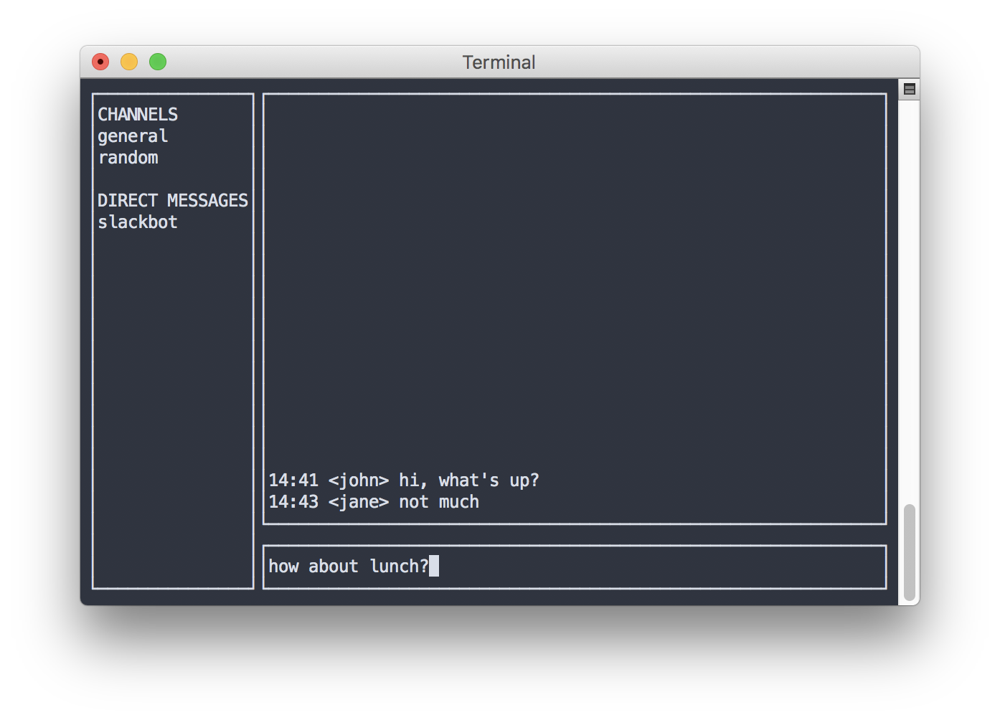

# tui: Terminal UI for Go

[](https://travis-ci.org/marcusolsson/tui-go)
[](https://godoc.org/github.com/marcusolsson/tui-go)
[](https://goreportcard.com/report/github.com/marcusolsson/tui-go)
[](LICENSE)


A UI library for terminal applications.

tui (pronounced _tooey_) provides a higher-level programming model for building rich terminal applications. It lets you build layout-based user interfaces that (should) gracefully handle resizing for you.



## Installation

```
go get github.com/marcusolsson/tui-go
```

## Usage

```go
package main

import "github.com/marcusolsson/tui-go"

func main() {
	box := tui.NewVBox(
		tui.NewLabel("tui-go"),
	)

	ui := tui.New(box)
	ui.SetKeybinding("Esc", func() { ui.Quit() })

	if err := ui.Run(); err != nil {
		panic(err)
	}
}
```

If you want to know what it is like to build terminal applications with tui-go, check out some of the [examples](example).

## Documentation

The documentation is rather bare at the moment due to the API changing pretty frequently. You can however explore the API in its current form at [godoc.org](https://godoc.org/github.com/marcusolsson/tui-go).

For now, the best way to learn tui-go is to study and learn from the [examples](example).

## Contributing

If you're using tui-go for your application, please let me know what works well for you, and _especially_ what doesn't (bug reports are greatly appreciated!).

Pull requests are very much welcome! Check out the [current issues](https://github.com/marcusolsson/tui-go/issues) to find out how you can help. If you do find anything interesting, please assign yourself to that issue so that others know you're working on it. If you want to contribute a feature not currently not listed, please create a new issue with a description of what you want to do. 

Please post any feature requests you might have. Smaller requests might end up being implemented rather quickly and larger ones will be considered for the road map.

### Contributors

- Marcus Olsson ([@marcusolsson](https://github.com/marcusolsson))
- Doug Reese ([@dougreese](https://github.com/dougreese))
- Eric Myhre ([@heavenlyhash](https://github.com/heavenlyhash))
- Fenimore ([@fenimore](https://github.com/fenimore))
- Gonzalo Serrano ([@gonzaloserrano](https://github.com/gonzaloserrano))
- Johan Sageryd ([@jsageryd](https://github.com/jsageryd))
- Pontus Leitzler ([@leitzler](https://github.com/leitzler))
- Yann Malet ([@yml](https://github.com/yml))

## Related projects

tui-go is mainly influenced by [Qt](https://www.qt.io/) and offers a similar programming model that has been adapted to Go and the terminal.

For an overview of the alternatives for writing terminal user interfaces, check out [this article](https://appliedgo.net/tui/) by [AppliedGo](https://appliedgo.net/).

## License

tui-go is released under the [MIT License](LICENSE).
